 # #DoHODL 

 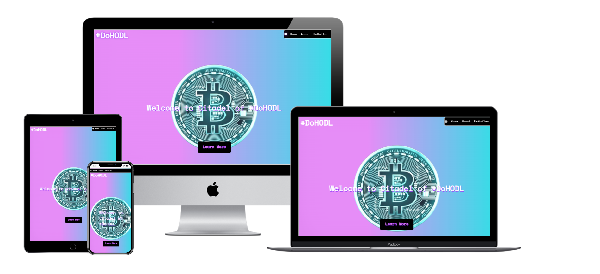

 ## Purpose of the Project

 **#DoHODL** this is an explanational and educational modern community that tries to explain Who? Why? How? I created a site to give more information for people of all ages to shift their undestanding of this technology (or at least will try to).
 Look of the website should be open, friendly, intuitive, responsive at all devices as cryptoassets. Ecourage people to contribute for this relatively small but powerfull instrument.  

 Website should be able to provide all information that user might expect to see at such specific theme and leave good aftertaste in terms of design and user experience
Link to [live site](https://bogdanfsd.github.io/-DoHODL/)

# **Contents**

* [**Objective**](<#objective>)
* [**UX (User Experience)**](<#user-ecperience-ux>)
  * [**User Stories**](<#user-stories>)
  * [**Owner Goals**](<#owner-goals>)
* [**Design Choices**](<#design-choices>)
  * [**Fonts**](<#fonts>)
  * [**Colors**](<#colors>)
  * [**Design Prototype**](<#design-prototype>)
* [**Features**](<#features>)
  * [**Future Features**](<#future-features>)
* [**Technologies**](<#technologies>)
  * [**Tools**](<#tools>)
  * [**Languages**](<#languages>)
  * [**Content**](<#content>)
* [**Testing**](<#testing>)
  * [**Code Validation**](<#code-validation>)
  * [**Responsive**](<#responsive>)
  * [**User Story Testing**](<#user-story-testing>)
  * [**Bugs Fixed**](<#bugs-fixed>)
  * [**Deployment**](<#deployment>)

# Objective

This is my first project where I developed website showing competence in HTML and CSS with best practise of coding, user experience together with testing and attention to details.

[Back to menu](#contents)

## **UX (User Experience)**

### **User Stories**

- Visiting site would like to find:
    - I want to understand what is Bitcoin(#BTC) and where it comes from.
    - I want to understand how it become so expensive.
    - I want to know if *BTC* is secure.
    - I want to understand why young people love it so much.
    - I want to know if I can earn buying a *Bitcoin*

- Returning to the site:
    - Is *Bitcoin* the only crypto?
    - How can I get a *Bitcoin*?
    - Is it possible to get in touch woth the community?

###  **Owner Goals**

- As owner I want user join the community.
- As owner I want user be able to contact our community through contact form.
- As owner I want to show that crypto is interestin, fun and lifechanging.

[Back to menu](#contents)

## **Design Choices**

### **Fonts**

I picked up [Space Mono](https://fonts.google.com/specimen/Space+Mono) as the one for entire project. It is easy to read and look reminds some technology as well great for contrast.

### **Colors**

Site mostly targeted for younger generations as practice shows for them it is easier get used to new technologies. So coors were choosen bright and colorfull all over the site, they are:

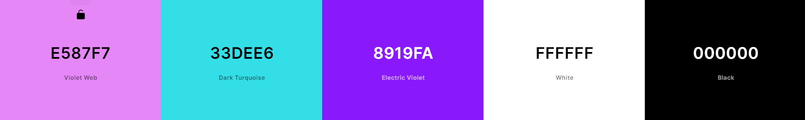

### **Design Prototype**

Honestly I didn't Use any programm or online redactor for this purposse as I got an idea from tthe begining how I want my site to look like.

[Back to menu](#contents)

## **Features**

-  **Header**
    - Navigation menu fixed to the right top corner and easy accessible at all times
    - Clickable navigation menu that direct user to area he would expect.
    - Once hovered links highlighted with neon light for better user experience.
    - Clickable logo that send you to home page.
    - Hashtag (#) with flickering effect same as logo on right side of menu to give feedback.
    - In mobile view navigation links  loose smooth corner and become all width long for better user experience.
    - Contrast colors designed for easier reading. 

<b>Desktop Navigation Links View</b>

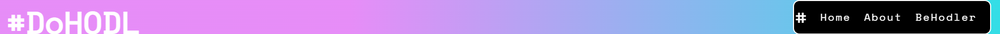

 

<b>Responsive Navigation Links View</b>

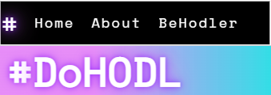

 

[Back to menu](#contents)

- **Hero Image**
    - Image placed in the center of the screen on top of gradient background in order not to overload user attention.
    - Image related to content

<b>Hero image</b>

 

[Back to menu](#contents)

- **Content**
    - Contains general and easy to understand information about community and technology.
    - Introduced user to Bitcoin

<b>Content</b>

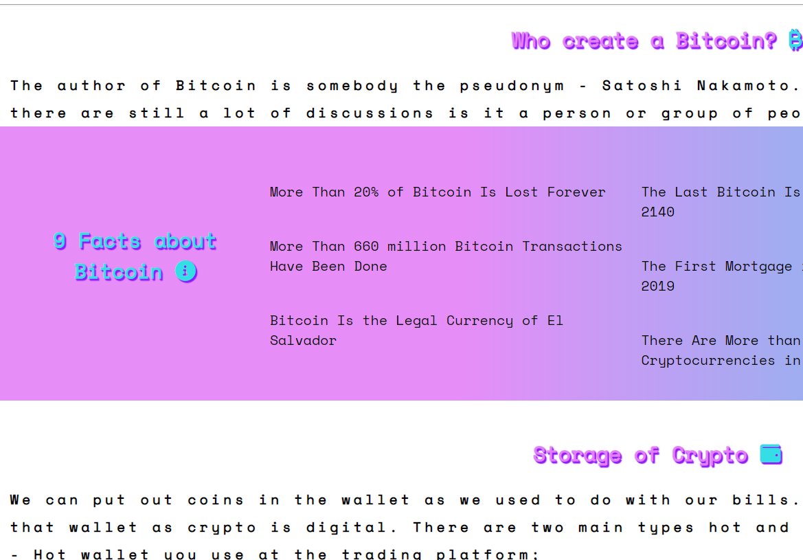

 

[Back to menu](#contents)

- **Footer**
    - Located at the bottom of the page.
    - Contains social media links and link to DoHODL chat in Telegram so user can easly get started.

<b>Footer</b>

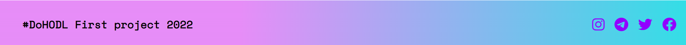

 

<b>Responsive Footer</b>

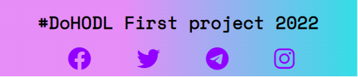

 

[Back to menu](#contents)

- **BeHodler**
    - Contact Us form for user to get totem NFT of the community. Showed error message if fields not filled correc or missed.
    - Tutorial aside of the form that explains how receive the totem NFT.
    - Submit button "HODL" where user would expect it.

<b>Contact Us</b>

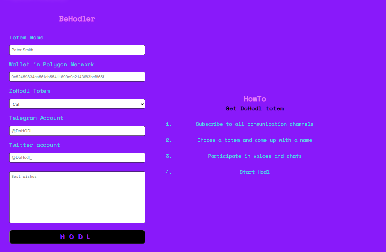

 

<b>Responsive Contact Us</b>

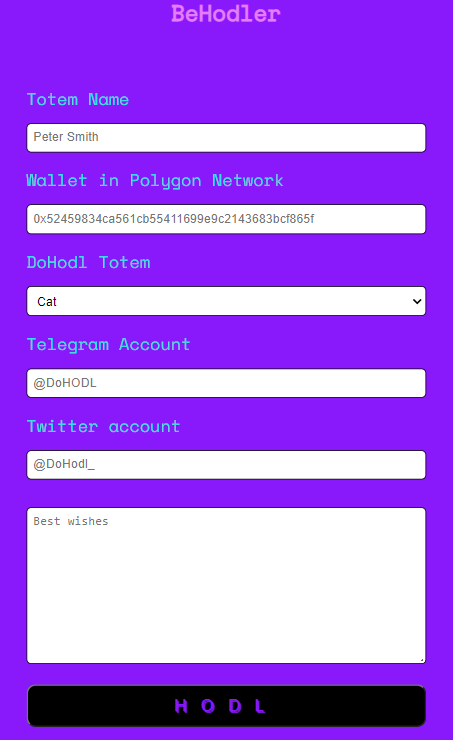

 

[Back to menu](#contents)

### **Future Features**

- I want to add live price of three favourite community coins.
- I want to create quiz about crypto and community for newcommers.
- I want add clothes, accessories and NFT that user can buy for Crypto only.
- I want to add Log In option for users and have profiles.

[Back to menu](#contents)

## **Technologies**

### **Tools**

+ [Gitpod](https://www.gitpod.io/) - IDE and just comfortable enviroment of coding, and sharing.
+ [GitHub](https://github.com/)-  deploying the project.
+ [Goodle Fonts](https://fonts.google.com/) - choosing and matching fonts.
+ [Favicons](https://favicon.io/) - generating icon for something
+ [Lighthouse](https://developers.google.com/web/tools/lighthouse) - checking responsivity of the site.
+ [Unsplash](https://unsplash.com/) - source of image.
+ [Coolors](https://coolors.co) - source of colors for design

[Back to menu](#contents)

### **Languages**

- [HTML5](https://www.w3schools.com/html/default.asp)
  - HTML is the standard markup language for Web pages.
- [CSS3](https://www.w3.org/Style/CSS/Overview.en.html)
  - Cascading Style Sheets (CSS) is a simple mechanism for adding style.

[Back to menu](#contents)

### **Content**

- [DoHodlChat](https://t.me/dohodlchat) community with deep knowledge about cryptocurrency.
- [Cointelegraph](https://cointelegraph.com/) as one of the most reliable source about crypto world.
- [2 quadrillion satoshi](https://t.me/Petasat) simple words about complex technology.

[Back to menu](#contents)

## **Testing**

 ### **Code Validation**

 - HTML validation
  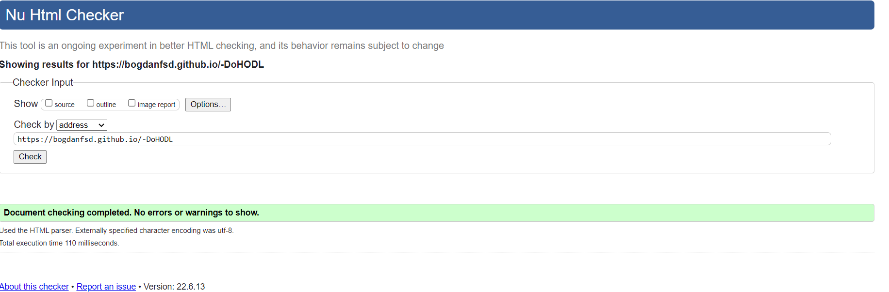

 - CSS validation
 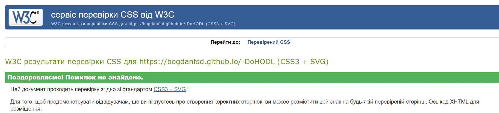

 - Lighthouse testing 

 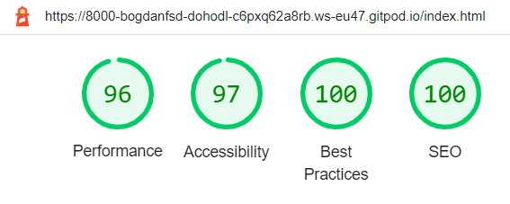

 [Back to menu](#contents)

### **Responsive**

Site is responsive. Tested with all browsers and screens. Live address was given to friends and tested as well.

[Back to menu](#contents)

### **User Story Testing**

- First time user
  - Clicking on button Learn More. Result: scrolling down to Content.
  - Want to go back to home page. Result: sticky navigation link in easy access.
  - Easy navigate during using the website. Result: layout and colors helps user to do that
  - Want to see what community is doing. Result: social media links available.

- User that returning back
  - Want to contact the owners. Result: Contac Us form working well if user will miss some input area or would type wrong input system wouldn't allow him to submit
  - Want to reread some part of the site. Result: mavigation links always available.
  - Fully responsive from any device

  [Back to menu](#contents)

### **Bugs Fixed**

*Console Error*

- Error that appeared while was checking website with the  help of Google Chrome Devtools. Seeing the red notification about favicon. Looks like site can't find an favicon.
 - Once favicon been in place bugs dissapear

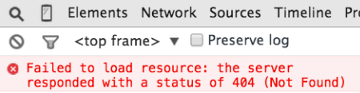

[Back to menu](#contents)

## **Deployment**

Website was developed with Gitpod and pushed to Github with this steps:

- Log In to *Github*
- Choose *user*
- Looking for setings and going down and left to *Pages*
- Searching for  *Source* and choose  *Branch Main*
- click *Save* and site will reload automatically with link where our site publiched

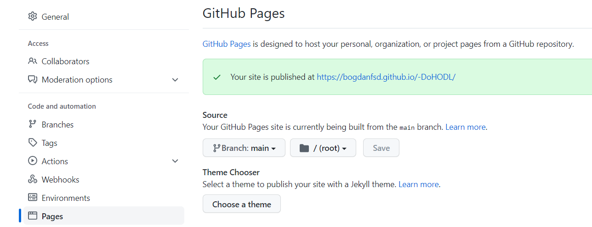

[Back to menu](#contents)

## **Credits**

Content

- Neon light came from [CSS-tricks](https://css-tricks.com/how-to-create-neon-text-with-css/)
- Icons came from [Font Awesome](https://fontawesome.com/)
- Colour palette displayed by [Coolors](https://coolors.co/)
- Font came from [Google Fonts](https://fonts.google.com/)

Media

-Image arrived from [Pexels](https://www.pexels.com/)

Acknowledgements

- My Mentor for confidence and advices with feedbacks
- Friends that were supporting me all the way

[Back to menu](#contents)